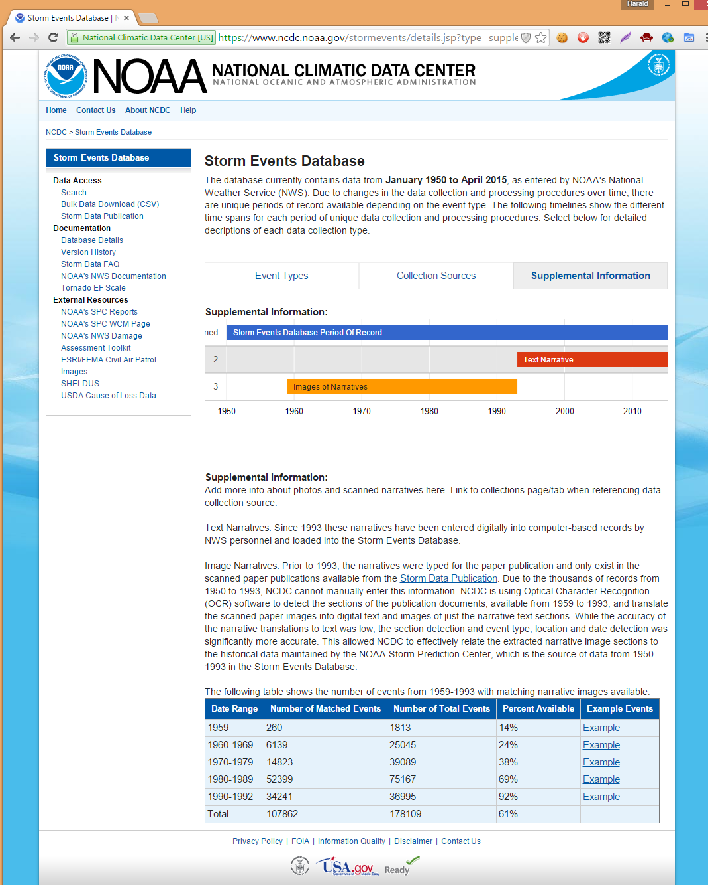

#Files

##NOAA\_SE\_EventTypes.png
This is a screenshot of the event sources description found at [https://www.ncdc.noaa.gov/stormevents/details.jsp?type=eventtype](https://www.ncdc.noaa.gov/stormevents/details.jsp?type=eventtype)  on 26th of June 2015 13:32 CEST. 

*This information is used to set constraints for the data range used in the analysis.*

##NOAA\_SED\_CollectionSources.png
This is a screenshot of the collection sources found at [https://www.ncdc.noaa.gov/stormevents/details.jsp?type=collection](https://www.ncdc.noaa.gov/stormevents/details.jsp?type=collection) on 26th of June 2015 13:32 CEST. 

##NOAA\_SED\_SupplementalInformation.png
This is a screenshot of the supplemental information found at [https://www.ncdc.noaa.gov/stormevents/details.jsp?type=supplemental](https://www.ncdc.noaa.gov/stormevents/details.jsp?type=supplemental) on 26th of June 2015 13:32 CEST. 

